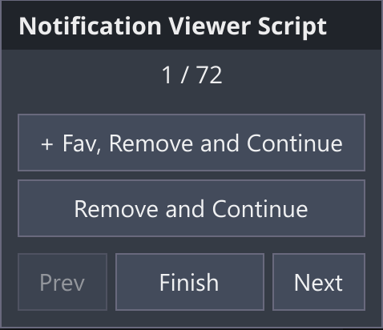

# fa-notification-viewer

A userscript to make viewing your Fur Affinitity notification backlog easier.

The script allows you to navigate through each submission in your new submission notifications, with buttons  
to navigate between submissions, add a submission to your favourites and automatically remove the submission   
notification, or remove the submission from your notifications without adding to your favourites.
  
---  

## Installation

1. Install a userscript plugin in your browser, e.g.:
   * [Violentmonkey](https://violentmonkey.github.io/)
   * [Tampermonkey](https://www.tampermonkey.net/)
2. Open the script and confirm installation : 

## Usage
1. Navigate to your Fur Affinity new submissions page: https://www.furaffinity.net/msg/submissions/
2. Click the Start Viewer button:  
   
3. Use the buttons on the control panel in the lower-right corner:  
   

* `+ Fav, Remove and Continue`:
  Add a submission to your favorites, remove the notification, and continue to the next submission.
* `Remove and Continue`:  
  Remove the submission from your notifications without adding it to your favourites.
* `Prev`:
  Navigate to the previous submission.
* `Finish`:
  Close the control panel.
* `Next`:
  Navigate to the next submission.
  
